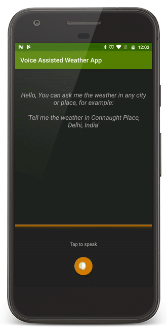

# Voice Assisted Weather App

### Overview
A simple weather application which extracts location information from voice commands and displays weather details.

The voice command may or may not have location information but must essentially have a weather intent. In case of absence of location information device location is used.

 

 

### Project Details
+ This project is built using MVP architecture
+ For speech recognition Android's built-in SpeechRecognizer API is used
+ Retrieval of weather intent and location information from the text obtained from speech recognizer is done by wit.ai service
+ Weather information is obtained using openweathermap.org
+ A custom view implementation is made to provide visual feedback for voice input

Basic unit tests and instrumentation tests are written but not all classes are covered.

 

### Libraries Used:
+ Mockito
+ Espresso
+ Retrofit
+ Dagger2
+ RxJava
